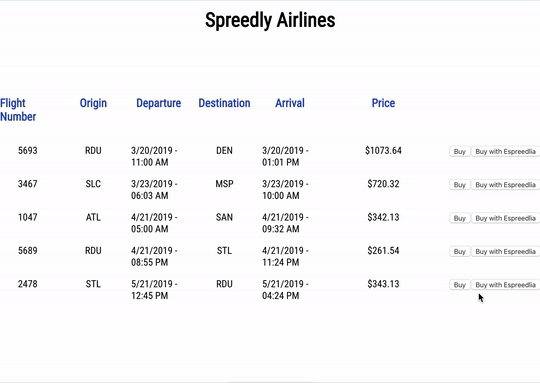

# ✈️ Spreedly Airlines ✈️



## Intro

Spreedly Airlines is intended to utilize the Spreedly API in the same way that a customer might. Process payments while minimizing PCI compliance scope.

## Run the app

The app has a decoupled front-end, written in `react`, and back-end written in `node/express`. To run locally, run the steps below.

### general

1. `clone` this repo
2. create `./server/.env` file and add the following keys:

```
ENV_KEY=<create_own>
ACCESS_SECRET=<create_own>
GATEWAY_TOKEN=<create_own>
RECEIVER_TOKEN=<create_own>
RECEIVER_URL=<create_own>
```

3. create `./client/.env` file and add the following keys:

```
REACT_APP_ENV_KEY=<create_own> - note this will be the same ENV_KEY from server .env
```

### front-end

1. navigate to `./client`
2. `npm i` to install dependencies
3. `npm start` to run the react app on port `3000`

### back-end

1. navigate to `./server`
2. `npm i` to install dependencies
3. `node server.js` to run the express app on `8000`

## Notes

- It wasn't immediately evident to me what use-case `PMD` would be used for. I had to read the docs several times to understand the use-case.
- While provisioning a `Test Receiver`, the [Single Card PMD Docs](https://docs.spreedly.com/guides/payment-method-distribution/single-card/) direct you to use [Spreedly Echo](https://spreedly-echo.herokuapp.com/). This server has been removed as a part of some compliance adjustment, so updating the docs to recommend an alternative workflow would be helpful. To work around this issue, I was directed to the repo for spreedly-echo server, and I was able to deploy temporarily for this project.
- I chose to use the `Spreedly Express` because it had the least amount of PCI compliance scope for Spreedly Airlines as a customer.
- I was receiving a `422` when trying to make a subsequent `purchase`, even though I had a `payment_method_token`. I learned this was because I had not `retain` the token. After talking to my onboarding buddy, I learned some context around retaining a payment method after a user has consented and PCI compliance.
- Initially I had implemented a conditional `save_on_success` property for both `purchase` and `deliver` to save the card for future use. My goal was to not make an additional API call if not necessary to limit costs. In implementation, however, this proved problematic, so I switched to making a separate `retain` call.

## Next Steps

- While the error handling is in place, not all of the error codes are user friendly.
